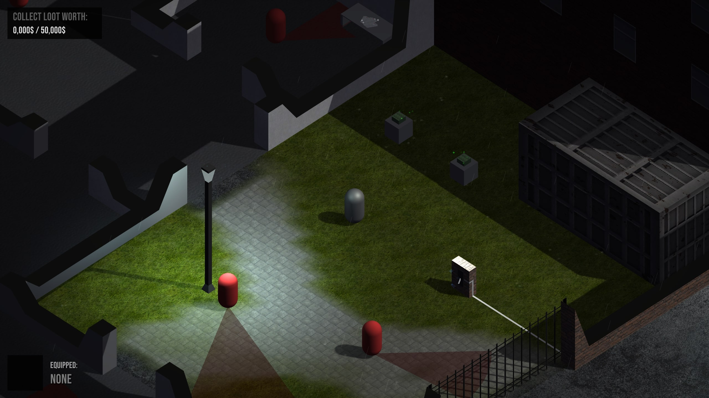

# StealthIsometric
Game created as a project, where you are the thief trying to steal goods from the warehouse, but you must beware of guards patrolling this building. Once they see you, they will try to catch you. If they get to you, you lose. Can you steal everything?

## Features
- 3D isometric world
- Preview level
- Camera zooming (using mouse scroll)
- 3 types of enemy patrolling
- 3 types of loot
- Interactable objects
- Challanging gameplay
- Localization (work in progress)

## Controls
- WSAD to move
- E for interacting with objects
- R to restart (only after failing or succeeding)
- Mouse Scroll to zoom camera

## Rendering Pipeline: Universal RP

## Packages used

- PolyBrush
- ProBuilder
- ProGrids [Preview]

## Unity version: 2020.1.1f1